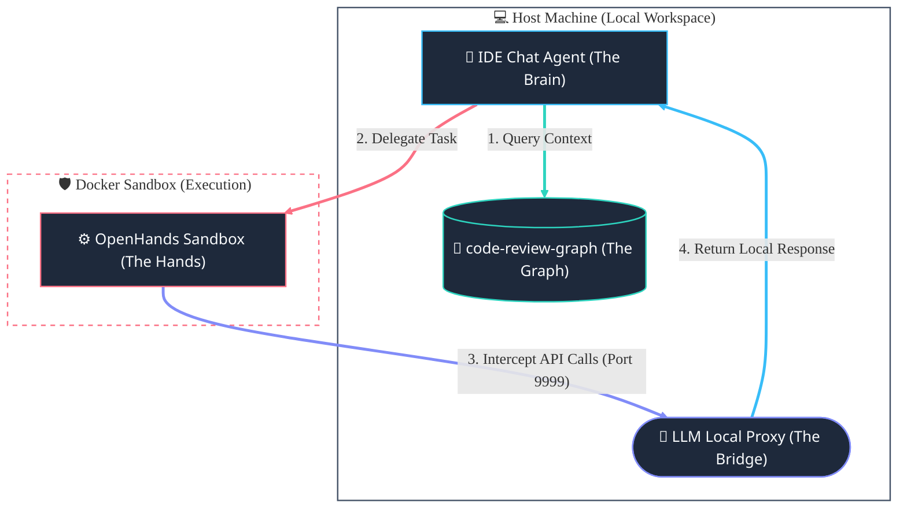

# 🦁 Hercules-MCP: Divined by the Brain, runed by the Graph, forged by the Hands


An ultra-efficient, highly collaborative agentic coding framework built using the **Model Context Protocol (MCP)**. This system establishes a division of labor between planning, structural code understanding, and execution, optimizing performance and reducing cost.

## 📐 System Architecture



---

## 🏷️ Recommended GitHub Repository Topics
To maximize discoverability, copy and paste these tags into your GitHub repository settings under **Topics**:
`mcp` `model-context-protocol` `openhands` `ai-agent` `agentic-workflows` `llm-proxy` `developer-tools` `sandbox` `sandbox-security` `code-indexing`

---


## 💻 Supported Clients & IDEs

Since this system is built entirely on the open-standard **Model Context Protocol (MCP)**, it is compatible with any MCP-enabled agentic environment, including:
*   **Antigravity IDE**
*   **Claude Code (CLI)**
*   **Cursor**
*   **VS Code** (using extensions like [Cline](https://github.com/cline/cline) or [Roo Code](https://github.com/RooVetGit/Roo-Code))
*   **Windsurf**
*   Any other MCP-compliant agent.


## 🏆 What Makes Hercules-MCP Unique in the MCP Ecosystem?

Unlike basic or naive MCP setups, Hercules-MCP is designed with enterprise-grade quality and robustness constraints. Here is how it compares to other solutions available in the GitHub market:

| Feature Dimension | Standard MCP Configurations | 🦁 Hercules-MCP System |
| :--- | :--- | :--- |
| **💵 LLM Running Cost** | Requires expensive personal API keys (OpenAI/Anthropic) to run OpenHands. | **100% Free** — Intercepts calls and routes them through your IDE's active built-in model (Claude/Gemini/GPT). |
| **🧵 Concurrency & Safety** | Single-user/single-session focus. Parallel runs or overlapping calls cause file collisions and socket blocking. | **Fully Concurrent** — Built on `ThreadingTCPServer` with unique UUID request-response files. |
| **📉 Token Cost Efficiency** | Standard tools dump entire files/directories into the context window, causing massive token waste. | **90% Token Reduction** — The Brain queries the Graph first to load only targeted, minimal line ranges. |
| **📁 Workspace Setup** | Hardcoded user paths that crash if shared, cloned, or run on different systems. | **Fully Dynamic** — Dynamic environment path fallback checks sibling directories and standardizes Windows backslashes. |
| **🛡️ Sandbox Security** | AI-generated code compiles and runs on the host machine, risking local file corruption. | **Isolated Sandbox** — Runs and validates all code changes using unit tests inside a Docker container sandbox. |
| **⚙️ Setup & Initialization** | Static startup scripts that crash if projects folder is missing or port `9999` is occupied. | **Self-Healing & Port Reclaiming** — Watcher thread polls for directory creation; startup terminates orphaned proxy ports automatically. |

---

## ⚡ Core Advantages & Main Features

This framework is built using the same design principles that guide enterprise-grade software engineering architectures:

*   **🔑 100% API-Key Free LLM Execution:** Eliminates the need for personal OpenAI, Anthropic, or Gemini API keys to drive OpenHands task execution. The system routes all execution requests directly through your IDE's active built-in model, saving massive API costs.
*   **🌉 Model-Agnostic LLM Proxy Bridge:** Utilizes a lightweight HTTP server ([llm_proxy.py](file:///d:/AI%20workspace/hercules-mcp/infrastructure/llm_proxy.py)) (default port `9999`, dynamically fallbacks to next free port, and fully customizable via `LLM_PROXY_PORT` environment variables) to intercept standard OpenAI Chat Completion calls from OpenHands and translate them into local files (`llm_request.json` / `llm_response.json`). This allows any model active in your IDE chat (Claude, Gemini, GPT, etc.) to drive the execution loop without modifications.
*   **🧩 True Separation of Concerns:** Decouples reasoning from execution.
    *   **The Brain (Orchestrator):** The IDE LLM (Gemini/Claude) serves purely as the architect, focusing 100% of its capacity on requirements, planning, and code design.
    *   **The Graph (Code Intelligence):** `code-review-graph` provides codebase analysis, semantic indexing, and dependency trees.
    *   **The Hands (Execution):** `openhands` acts as the isolated execution layer where changes are securely compiled and tested.
*   **📉 90% Token Cost Reduction:** Traditional tools dump entire files and directories into the context window, wasting tokens and causing model confusion. By querying the `code-review-graph` first, the orchestrator retrieves only the minimal, target line ranges required to understand a change.
*   **🛡️ Isolated "Shift-Left" Sandbox Security:** Running AI-generated code directly on your local system is a major security risk. This system isolates all writes, compiles, and runs inside a secure **Docker container sandbox** (`openhands`). Changes are automatically verified via unit tests inside the sandbox before being written back, keeping your host system safe.
*   **📋 Persistent Workspace & Session Memory:** Automatically maintains a standard task checklist (`task.md`) in the conversation artifacts directory and project context guidelines (`AGENTS.md`) in the workspace, ensuring the model never forgets the task state between IDE restarts.
*   **🧹 Safe Sandbox Cleanliness & Verification:** Automatically runs and validates all code changes using unit tests inside the Docker sandbox, and automatically cleans up temporary files post-execution. Supports a safe Docker system prune shortcut that deletes builder cache and stopped containers without touching database data volumes.
*   **🔄 100% Environment Reproducibility:** By using Docker containerization, development environments, compilers, and dependencies are identical for every developer on the team, eliminating local version mismatches and the "works on my machine" problem.
*   **🔌 IDE & Client Agnosticism:** Built entirely on the open-standard **Model Context Protocol (MCP)**, this system works out-of-the-box across **Cursor**, **VS Code** (Cline/Roo Code), **Antigravity IDE**, **Claude Code (CLI)**, or any other MCP-compliant interface.

---

## 🔄 Independent Core Updates

To ensure your environment remains up-to-date with the latest features, the core tools are **not** frozen in this repository. You download and update them directly from their official sources:

1.  **OpenHands:** You clone and update it directly from the [official OpenHands GitHub repository](https://github.com/All-Hands-AI/OpenHands).
2.  **Code-Review-Graph:** You install and upgrade it globally using its official package manager.

This repository serves strictly as your custom integration, routing rules (`AGENTS.md`), and FastMCP connection layer.

---

## 🌍 Cross-Platform & Environment Robustness

This system is engineered to work reliably on any developer machine under any conditions:

*   **💻 Cross-Platform Path Standardizing (Windows, macOS, Linux):** The integration script `openhands_mcp.py` dynamically normalizes path separators (mapping Windows backslashes `\` to standard Unix slashes `/` inside the sandbox). It resolves local workspace paths dynamically using environment variables or relative fallbacks.
*   **🔌 IDE & Client Independence:** Since the system is built entirely on the standard **Model Context Protocol (MCP)**, it works out-of-the-box across **Cursor**, **VS Code** (Cline/Roo Code), **Antigravity IDE**, **Claude Code (CLI)**, or any other MCP-compliant interface. The onboarding system automatically guides the active LLM to write configurations to the correct paths depending on the editor in use.
*   **📁 Custom Workspace & Folder Naming Support:** The two-tier architecture keeps system configs (System Root) separate from codebase projects (Projects Folder). The folders can be named **anything** (e.g. `Projects`, `my-software`, `src`). During onboarding, the LLM detects or asks the user for their directory names, links them dynamically, and creates them if they don't exist yet. The file-watcher automatically picks up any new projects added to that directory in the future.
*   **🛡️ Git Cleanliness:** The `.gitignore` prevents machine-specific configuration files (such as `.DS_Store`, local `.venv/`, `.gemini/` credentials, or your active `mcp_config.json` containing personal API keys) from being tracked, ensuring no conflicts when pushing or pulling.

---

## ⚙️ Setup Guide

### 1. Prerequisites
Ensure you have the following installed on your machine:
*   [Docker Desktop](https://www.docker.com/products/docker-desktop/) (Required to run OpenHands and GitHub MCP Server)
*   [Python 3.10+](https://www.python.org/) and [uv](https://github.com/astral-sh/uv) (for running python MCP services)
*   [Node.js](https://nodejs.org/) (for running Stitch / NPX commands)

### 2. Core Setup

#### Step A: Setup Code-Review-Graph
Install `code-review-graph` globally on your system. Follow the official installation instructions for your OS to make sure the `code-review-graph` CLI is accessible on your system Path.

#### Step B: Setup OpenHands
1.  Clone the official OpenHands repository:
    ```bash
    git clone https://github.com/All-Hands-AI/OpenHands.git
    ```
2.  Build and run the OpenHands local container/instance according to their [Development Guide](https://github.com/All-Hands-AI/OpenHands/blob/main/Development.md).
3.  Note down the local URL (usually `http://localhost:8000`) and API token.

---

## 🚀 Easy Onboarding (LLM Bootstrap & File Architecture Guide)

This workspace is structured using a **two-tier file architecture** designed to keep global system configurations separate from your codebase projects, preventing task-tracking conflicts:

### 📐 Two-Tier File Architecture & Flow:
1.  **🌌 System Root (`WORKSPACE_ROOT`)**:
    *   This is the main parent directory of your workspace (e.g., `D:/AI workspace`).
    *   **Contents**: Contains the `hercules-mcp` repository, global rulebook (`.agents/AGENTS.md`), general MCP server configurations (`mcp_config.json`), and the global persistent log file ([task.md](file:///d:/AI%20workspace/task.md)).
    *   **Purpose**: Tracks system-level setup, tool versions, and rule adjustments across all session lifetimes.
2.  **📁 Projects Directory (`PROJECTS_DIR`)**:
    *   This is a dedicated subfolder directly under the System Root (default name `Projects/`, e.g., `D:/AI workspace/Projects`).
    *   **Contents**: Contains your individual coding projects, apps, and software repositories (e.g., `ML_PROJECT-1/`, `auto-test-mcp/`).
    *   **Purpose**: Each folder here maintains its own local isolated `task.md` checklist, ensuring the active agent never confuses project code changes with system configuration updates.

---

### 📋 Copy-Paste Onboarding Prompt:
When opening this workspace for the first time in an MCP-compliant agentic environment (Cursor, VS Code Cline/Roo Code, Antigravity, or Claude Code), **copy and paste this exact prompt** into the chat window. The agent will read it, dynamically detect your workspace paths, and configure your MCP settings automatically:

```markdown
Please help me bootstrap my local Hercules-MCP system. Act as an expert system configuration agent and execute the following steps:

1.  **Understand the File Architecture**:
    *   Identify the absolute path of this workspace root on my machine. This is the `WORKSPACE_ROOT`.
    *   Identify the sibling or child projects directory. By default, this is a folder named `Projects/` located directly under or next to the workspace root. This is the `PROJECTS_DIR`.
    *   Verify if `PROJECTS_DIR` exists. If it does not exist yet, create it.

2.  **Detect Environment & IDE**:
    *   Detect which IDE or agent client we are currently running in (e.g., Antigravity IDE, VS Code with Cline/Roo Code, Cursor, or Claude Code CLI).

3.  **Request User Credentials**:
    *   Ask me to paste my GitHub Personal Access Token (PAT).

4.  **Configure MCP settings**:
    *   Write the configuration payload shown below to the correct path based on our active IDE client:
        *   **Antigravity IDE**: `C:\Users\<username>\.gemini\antigravity-ide\mcp_config.json`
        *   **VS Code (Cline/Roo Code)**: 
            *   Windows: `%APPDATA%\Code\User\globalStorage\saoudrizwan.claude-dev\settings\cline_mcp_settings.json`
            *   macOS: `~/Library/Application Support/Code/User/globalStorage/saoudrizwan.claude-dev\settings\cline_mcp_settings.json`
        *   **Claude Code CLI**: `~/.claude.json`
        *   **Cursor**: Since Cursor uses a settings GUI, print out the exact values (Name, Type, Command, Args, Env) and give me step-by-step instructions on how to enter them manually in Cursor's settings.

5.  **Apply Path & Env Variables**:
    *   In the `env` section of the `openhands` server configuration, you MUST inject the `WORKSPACE_ROOT` and `PROJECTS_DIR` paths.
    *   **CRITICAL WINDOWS PRECAUTION**: When writing paths to `mcp_config.json` or client settings, you MUST replace all backslashes (`\`) with forward slashes (`/`) (e.g., `D:/AI workspace/hercules-mcp`). This prevents JSON escape corruption crashes.

### Configuration Template to Apply/Generate:
{
  "mcpServers": {
    "github-mcp-server": {
      "command": "docker",
      "args": [
        "run",
        "-i",
        "--rm",
        "-e",
        "GITHUB_PERSONAL_ACCESS_TOKEN",
        "ghcr.io/github/github-mcp-server"
      ],
      "env": {
        "GITHUB_PERSONAL_ACCESS_TOKEN": "<USER_GITHUB_TOKEN>"
      }
    },
    "code-review-graph": {
      "command": "code-review-graph",
      "args": [
        "serve",
        "--auto-watch"
      ]
    },
    "openhands": {
      "command": "uv",
      "args": [
        "run",
        "<DETECTED_WORKSPACE_PATH>/infrastructure/openhands_mcp.py"
      ],
      "env": {
        "WORKSPACE_ROOT": "<DETECTED_WORKSPACE_PATH>",
        "PROJECTS_DIR": "<DETECTED_PROJECTS_DIR_PATH>"
      }
    }
  }
}
```
Verify the configuration once complete and confirm when we are ready to build!
```


---

## 🧪 Verifying Your Installation

Once you have completed the onboarding setup, you can test that the entire system (Brain + Graph + Hands) is working together correctly by using the following verification challenge.

> [!NOTE]
> The verification challenge should only be run **once** per installation. If the `verification_test` directory already exists in the workspace and has been successfully resolved, the agent will detect it, notify you that verification is already complete, and skip running it again to conserve tokens and prevent redundant execution.

### The Verification Challenge Prompt:
Copy and paste this prompt into your agentic chat window:

```markdown
Let's run a verification test for our Hercules-MCP system. Please execute the following steps:

1. Create a new directory in our workspace called `verification_test`.
2. Inside it, create a Python script with a deliberate logic bug (e.g., a function that is supposed to calculate fibonacci numbers but has an incorrect recursion base case).
3. Use the `code-review-graph` tools to index the new directory and locate the code.
4. Delegate the task of fixing the bug and running a unit test validation to the `openhands` server.
5. Once fixed and tested, output a summary report showing:
   - The original broken code vs. the fixed code.
   - The verification test status.
   - An estimate of the token context saved by using the graph-targeted lookup rather than passing the whole file/directory into the context window.
6. Delete the `verification_test` directory (or clean up its Python files) to keep the repository clean after the server has successfully passed the tests.
```

### Expected Results:
If the setup is fully functional, your agent will:
1. Automatically write the broken script.
2. Query the graph to register/index it.
3. Call `openhands.run_task` to spin up a sandboxed execution, correct the logic, and write a verification test.
4. Output a summary report showing the fix and demonstrating the token efficiency gains of the system (typically saving 80% to 95% of context window tokens compared to standard, full-file reading).
